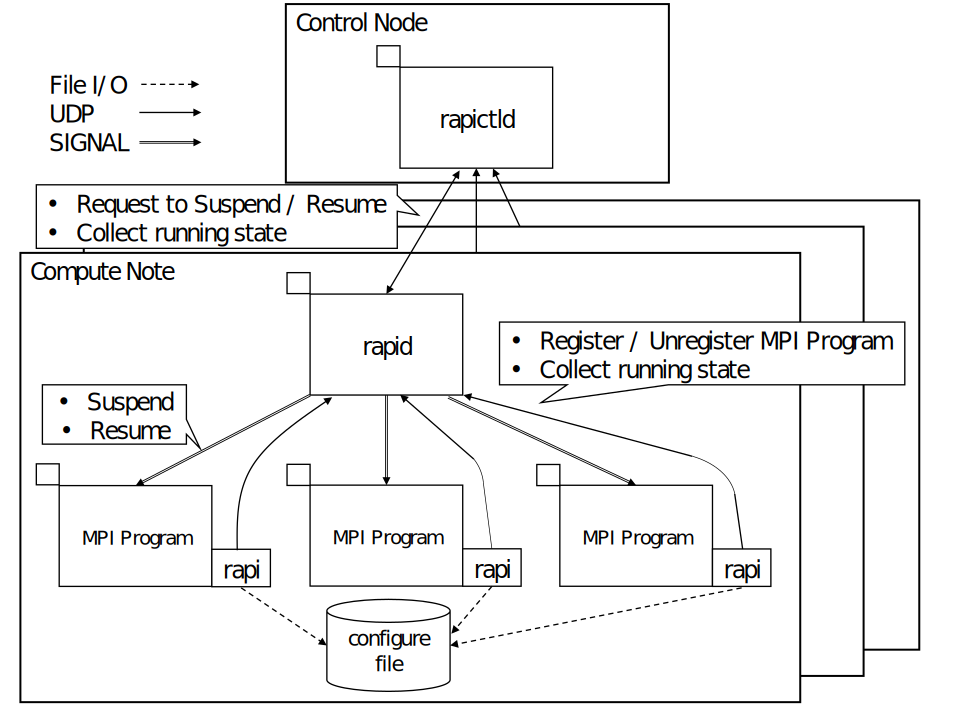

# rapi


## Summary
This system is a Job Scheduler that works **cooperatively** with MPI programs, and consists of below three programs.
* [rapi](./rapi) is a program that works with MPI programs using MPI profiling interface.
* [rapid](./rapid) is a program that manages MPI programs.
* [rapictld](./rapictld) is a program that manages all rapid.

## How cooperative?
1. Rapi sends MPI program information such as "whether is interactive" or "how to stop"
    This allows job scheduler more flexible job management.
2. Rapi sends MPI program's running state such as "Now enter MPI_Send function"
    This allows job scheduler to adjust the timing to suspend/resume jobs.

## Build and Install
1. Clone this repository
    ```bash
    git clone https://github.com/nomlab/rapi.git && cd rapi
    ```
2. Build
    ```bash
    make
    ```
3. Install
    ```bash
    sudo make install # Install rapi.so, rapid, rapictld into /usr/local/bin/
    ```
    ```bash
    make install-local # You can use local install (~/.local/bin/)
    ```
In the above procedure, installation is applied to only one node.
You must do this on all nodes you use.
Or use file sharing, such as NFS.

## Usage
1. Launch rapictld on the control node
    ```bash
    # Interval between suspend and resume is 10ms
    # Compute nodes that locate rapid are "compute_node1" and "compute_node2"
    rapictld -t 10 -n computing_node1,cpmputing_node2
    ```
    ```bash
    # You can use debug message
    rapictld -t 10 -n computing_node1,cpmputing_node2 -d Debug
    ```
2. Launch rapid on all compute nodes
    ```bash
    # Launch rapid on each node
    rapid -a control_node
    ```
    ```bash
    # Launch with ssh
    ssh compute_noding1 rapid -a control_node
    # Or launch on background (But it is difficult to kill rapid)
    ssh -f computing_node1 rapid -a control_node
    ```
    ```bash
    # You can use debug message
    rapid -a control_node -d Debug
    ```
3. Launch an MPI program with specifying "LD_PRELOAD"
    ```bash
    # -x option is to set environment variable for all MPI processes
    mpirun -x LD_PRELOAD=/usr/local/bin/rapi.so mpi_program
    ```

### Script
You can use a script for launching rapid, rapictld and MPI program (with rapi).
#### Preparation
1. Setup rapi
    * Install rapi.so and rapid to all computing-nodes, and add the location of them to PATH
    * Install rapictld to the control-node, and the location of it to PATH
2. Setup MPI
    * Install `mpirun` to all computing-nodes
    * Install an MPI program you use to the same location
    * Install `hostfile` to the control-node
3. Setup ssh
    * Control-node can ssh to all computing-nodes with
        * the hostname in `hostfile`
        * no password or passphrase
#### Launch
Run the script on control-node
```bash
script/run.sh -h hostfile -t 100 -p example_program -l log/$(date "+%Y%m%d%H%M%S").log
```
